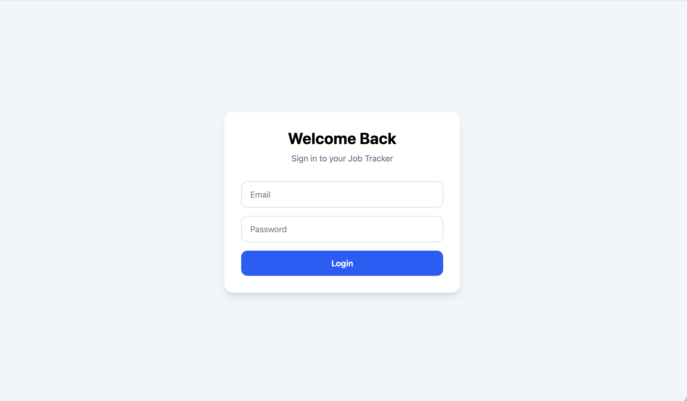
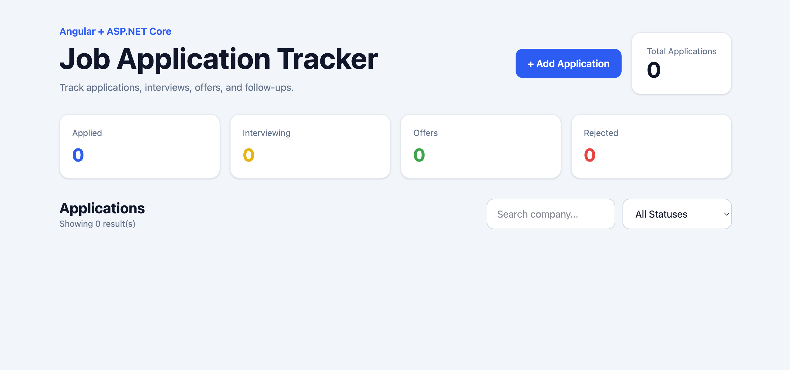
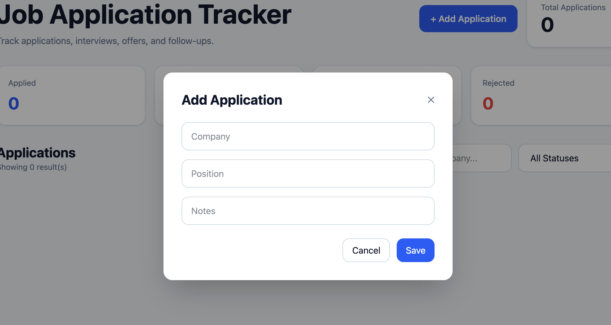

# Job Application Tracker

## Features
- JWT Authentication
- User Registration/Login
- Protected Routes
- CRUD Job Applications
- Search and Filtering
- Dashboard Metrics

## Tech Stack
- Angular 22
- ASP.NET Core 8
- Entity Framework Core
- SQLite
- Tailwind CSS
- JWT
- BCrypt

## Screenshots

### Login

### Dashboard

### Add Application Modal

## Future Improvements
- PostgreSQL
- Deployment
- Refresh Tokens
- Kanban Board
